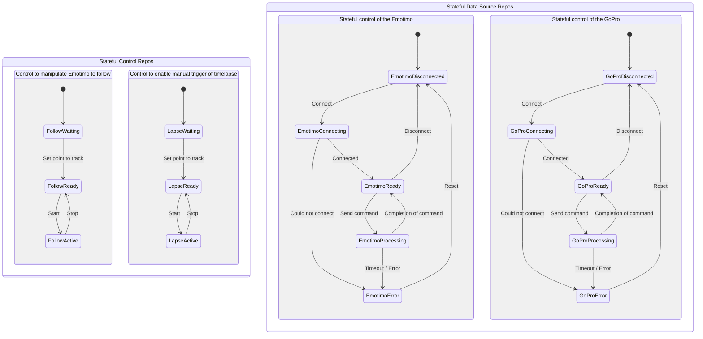

Technical Architecture
======================

# 1. High Level Architecture

```mermaid

graph TD;

    subgraph "AsyncIO Execution"

    G[API Requests]

        subgraph "State Machine Task"
            
            A[State Machine]
            C[Emotimo Control]
            D[GoPro Control]

        end

        subgraph "FastAPI Task"
            E[FastAPI Server]
            F[API Routes]

        end

        A <-->|Controls| C
        A <-->|Controls| D
        
        E -->|Handles Requests| F
        F -->|Sends Commands| A
        G -->|Makes Request| F
    end

    style A fill:#404,stroke:#fff,stroke-width:2px
    style E fill:#044,stroke:#fff,stroke-width:2px

```

# 2. State Machines

```mermaid

stateDiagram-v2

    control: Stateful Control Repos
    state control {
        
        follow: Control to manipulate Emotimo to follow
        state follow {
        
            [*] --> FollowWaiting 
            FollowWaiting --> FollowReady : Set point to track
            FollowReady --> FollowActive : Start
            FollowActive --> FollowReady : Stop
        
        }

        lapse: Control to enable manual trigger of timelapse
        state lapse {
        
            [*] --> LapseWaiting
            LapseWaiting --> LapseReady : Set point to track
            LapseReady --> LapseActive : Start
            LapseActive --> LapseReady : Stop
        
        }
    }

    repo: Stateful Data Source Repos
    state repo {

        emotimo: Stateful control of the Emotimo
        state emotimo {

            [*] --> EmotimoDisconnected
            EmotimoConnecting --> EmotimoError : Could not connect
            EmotimoConnecting --> EmotimoReady : Connected
            EmotimoReady --> EmotimoProcessing : Send command
            EmotimoProcessing --> EmotimoReady : Completion of command
            EmotimoProcessing --> EmotimoError : Timeout / Error
            EmotimoReady --> EmotimoDisconnected : Disconnect
            EmotimoError --> EmotimoDisconnected : Reset
            EmotimoDisconnected --> EmotimoConnecting : Connect

        }

        gopro: Stateful control of the GoPro
        state gopro {

            [*] --> GoProDisconnected
            GoProConnecting --> GoProError : Could not connect
            GoProConnecting --> GoProReady : Connected
            GoProReady --> GoProProcessing : Send command
            GoProProcessing --> GoProReady : Completion of command
            GoProProcessing --> GoProError : Timeout / Error
            GoProReady --> GoProDisconnected : Disconnect
            GoProError --> GoProDisconnected : Reset
            GoProDisconnected --> GoProConnecting : Connect

        }
        
    }

```